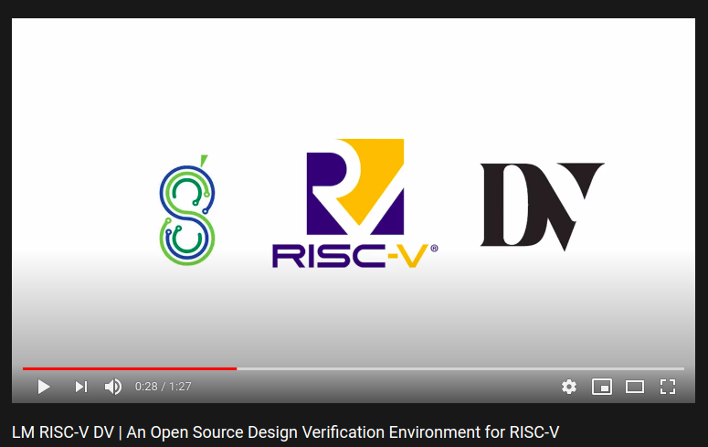

# Overview

LM RISC-V DV is a verification environment which integrates [SweRV EH-1 Core](https://github.com/chipsalliance/Cores-SweRV) from Western Digital and a random assembly test generator from [RISCV-DV](https://github.com/google/riscv-dv) which is a SV/UVM based instructions generator. This is a work in progress. At present it supports:

- RTL Compilation
- Random Assembly Test Generation
- Test Compilation (Random, Directed)
- RTL Simulation
- Spike ISS Simulation
- Post-simulation Comparison with ISS (Spike)
- Code Coverage Report Generation
- Extraction of Functional Coverage

You can watch the [**Youtube playlist**](https://www.youtube.com/watch?v=I8ISkRhPA5M&list=PLLBoDLOd3AMSHjz4mMJsWfSNV-TZBWArQ) about an [**Introduction to LM RISC-V DV**](https://www.youtube.com/watch?v=I8ISkRhPA5M&t=1s) and its [**Detailed Environment Demo**](https://www.youtube.com/watch?v=Pu-si58uosA&t=3s).

[](https://www.youtube.com/watch?v=I8ISkRhPA5M&list=PLLBoDLOd3AMSHjz4mMJsWfSNV-TZBWArQ)


## Directory Structure

```bash
├── cores/
├── docs/
├── google_riscv_dv/
├── integrated_cores/
├── integration_files/
│   └── SweRV_EH1/
│       ├── directed_tests/
│       ├── google_riscv_dv/
│       ├── riscv_dv_extension/
│       ├── snapshots/
│       ├── testbench/
│       ├── yaml/
│       ├── cover.cfg
│       ├── Makefile
│       ├── sim.py
│       ├── SweRV_EH1_flist.f
│       └── waves.tcl
└── scripts/
    ├── core_integrate.sh
    └── toolchain_paths.sh
```

### [cores](./cores)/

This directory is a place holder which will contain the cores in their original source forms cloned from their sites. Currently, LM RISC-V DV has been set up and tested for SweRV EH-1 core. When the cores are cloned, they will be checked out to the most recent versions which have been tested in this environment.  

### [docs](./docs)/

This directory is dedicated to all the documentation related to directory structure and environment flow. It also contains documentation for tests which are generated for a specific core.

### [google_riscv_dv](./google_riscv_dv)/

RISCV-DV is cloned into this repository. It contains the source for random assembly test generator written in SystemVerilog/UVM.

### [integrated_cores](./integrated_cores)/

After the cores and RISCV-DV are cloned into their respective directories, the verification environment for the cores will be set up here with each core in its separate directory.

### [integration files](./integration_files)/

This directory contains files which will be used in setting up the verification environment. It contains:

- Makefiles, python scripts, YAML files, linker files, and core configuration files
- Modified RISCV-DV files specific for cores
- Modified RTL and Testbench files related to cores

### [scripts](./scripts)/

All the scripts for setting up the repository and core integration will be placed in this directory. At present, it contains two scripts.

- [core_integrate.sh](./scripts/core_integrate.sh)
- [toolchain_paths.sh](./scripts/toolchain_paths.sh)

## Pre-Requisites

Following are the requirements for running the test generator and environment.

- RISC-V GNU Toolchain
- Instruction Set Simulator ISS (Spike)
- Python 3
- SV and UVM 1.2 Simulator

For manually building the `RISC-V GNU Toolchain`, visit the [riscv-gnu-toolchain](https://github.com/riscv/riscv-gnu-toolchain) repository on Github. Pre-built toolchains can be downloaded from [SiFive Software](https://www.sifive.com/software) Page. We are using `Spike ISS` for LM RISC-V DV. It can be manually built from the source which can be obtained from [riscv-isa-sim](https://github.com/riscv/riscv-isa-sim) repository. `Python 3.7` or above is recommended for the python scripts to work properly for test generation, compilation and simulation. According to RISCV-DV Documentation, a number of `simulators` has been verified with the test generator including Synopsys VCS, Cadence Incisive/Xcelium, Mentor Questa, and Aldec Riviera-PRO.

## Setup

After the `RISC-V GNU toolchain` and `Spike` (or any other RISC-V ISS) are installed, their installation paths should be added to the `~/.bashrc` file in `RISCV_PATH` and `SPIKE_PATH` (or path variable corresponding to installed ISS) variables respectively. Following is the sample of paths to be added on a ubuntu OS.

```bash
export RISCV_PATH = <path to>/riscv64-unknown-elf-gcc-8.3.0-2019.08.0-x86_64-linux-ubuntu14
export SPIKE_PATH = <path to directory containing spike executable>
```

Their is a [toolchain_paths.sh](./scripts/toolchain_paths.sh) script in [scripts/](./scripts) directory. You need to `source` it after exporting the above paths in the `~/.bashrc` file as

```bash
source <path to toolchain_paths.sh>
```

## Integration of Core with RISCV-DV

[core_integrate.sh](./scripts/core_integrate.sh) is a `bash` script placed in [scripts/](./scripts). You just simply need to run the script through terminal for setting up the environment for the core.

```bash
./core_integrate.sh
```

When the script is run, it:

- clones the cores (SweRV EH-1 for now) and RISCV-DV into their respective folders
- checkouts the sources to the lastest tested commit versions
- takes the required RTL and Testbench sources from [cores](./cores) and integration files, and set up the environment in [integrated_cores](./integrated_cores)

Currently, only SweRV EH-1 has been integrated. It will thus set up the environment for the SweRV EH-1 core only.

## Contribution

This is a work in progress. We'd like to accept your contributions to this project.

## Acknowledgement

- [RISCV-DV](https://github.com/google/riscv-dv)
- [SweRV EH-1 Core (Western Digital)](https://github.com/chipsalliance/Cores-SweRV)
- [Ibex core (lowRISC)](https://github.com/lowRISC/ibex)

## Contact

If you have any queries, feel free to contact us at hardware@lampromellon.com or contact page on our site [Lampro Mellon](http://www.lampromellon.com).
