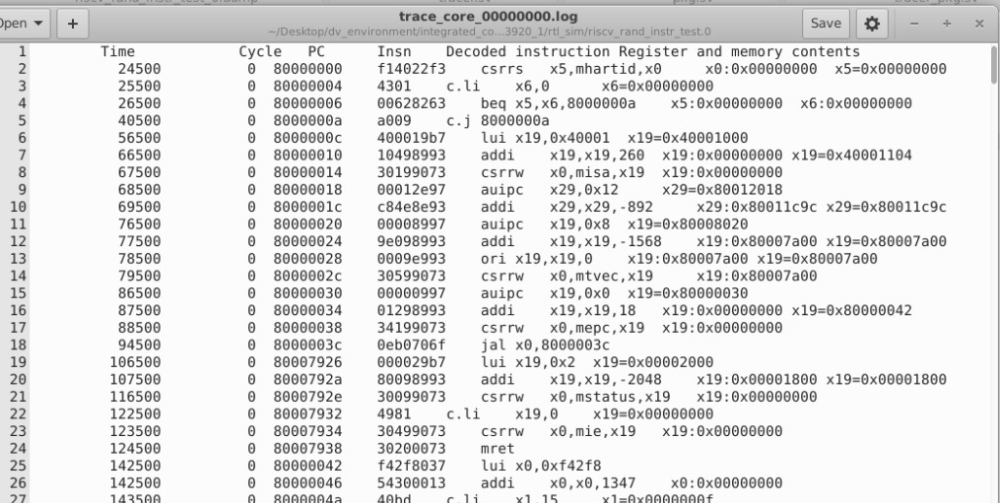

# SweRV EH1 Tracer Implementation
---

### Introduction
 
Advanced debugging capability that allows capturing code execution and system events. A tracer is implemented to help designers to find what is going on when the instructions are being executed. It produces a text (log) file with a human-readable trace that enables the users to determine the exact set of instructions executed by the core. It is used for debugging and analyzing functional verification.

Features two main categories:

- **Core Trace:** inspects the code execution
- **System Trace:** oversees the system behaviour
  
Currently we are focussing on implementing core trace.

### The Trace file

The tracer takes execution information from the RISC-V Verification Interface (RVFI) and produces a log file. Trace imports a file named **tracer_pkg** which in turn imports a **pkg** file. 

SweRV EH1 is a dual issue core and so the trace file is updated to implement dual issue. On a *valid* signal, the corresponding bits of the PC, instruction and the respective registers are used to generate a log file named **trace_core_xxx.log**. Tracer module is instantiated in **tb_top**. ***rtl_sim*** target is used for the generation of trace log files for corresponding number of tests. ***iss_sim*** target generates the trace log files of the Spike ISS simulation. Both of these trace log files are then utilized in *post-sim* comparison.

### Output file 

A log file named **trace_core_xxx.log** is generated as an output of the tracer implementation. It contains the time instants, cycle count, PC, decoded instruction, operands' registers and the memory contents.

#### Tracer Output Format

The output log is in the following format containing six columns, separated by tabs:

- **Simulation Time:** The current simulation time.
- **Clock Cycle Count:** The number of cycles since the last reset.
- **Program Counter (PC):** The program counter.
- **Instruction:** The executed instruction (hexadecimal). 32 bit wide instructions (8 hex digits) are uncompressed instructions, 16 bit wide instructions (4 hex digits) are compressed instructions.
- **Decoded Instruction:** Decoded instruction string, together with the accessed registers and read/written memory values. Jumps and branches show the target address.
- **Register and memory contents:** For all accessed registers, the value before and after the instruction execution is given. For memory accesses, the address and the loaded and stored data are given.

*Figure-1* shows a trace log file generated for a **riscv_rand_instr_test.0** test.

  

 <b><i>Figure-1</i>: <i>Trace log file</i></b> 
