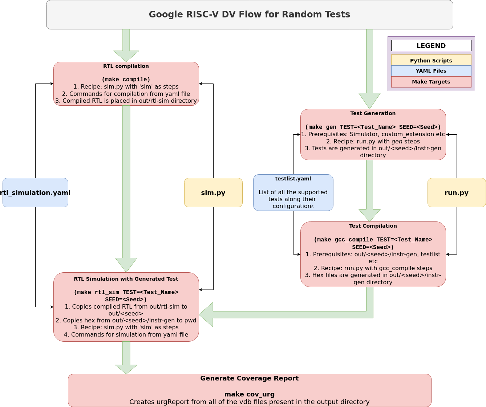

# SweRV Environment Setup with Google's RISCV-DV

This document briefly highlights the directory structure and files used in integration of SweRV EH1 with Google RISC-V DV.

## Directory Structure

Following is the directory structure of integrated SweRV EH1 core with Google RISC-V DV.

```
SweRV_EH1
    ├── directed_tests/
    ├── riscv_dv_extension/
    │   ├── riscv_core_setting.sv
    │   └── testlist.yaml
    ├── rtl/
    ├── snapshots/
    ├── testbench/
    ├── yaml/
    │   └── rtl_simulation.yaml
    ├── cover.cfg
    ├── Makefile
    ├── sim.py
    ├── SweRV_EH1_flist.f
    └── waves.tcl
```

### directed_tests/

This directory will contain directed tests to be run on the core. Assembly tests are placed in `asm/` sub-directory whereas C tests are placed in `c/`. The purpose of these two subdirectories is to just keep the directory structure clean and consistent.

### riscv_dv_extension/

This directory contains atleast two files which are used by RISCV-DV. These files provide customization according to the core we are integrating with RISCV-DV.  

`riscv_core_setting.sv` contains all of the necessary configurations related to core. For example register lengths, supported instruction extensions, unsupported instructions, supported CSRs, types of exceptions and interrupts etc. Update this file according to core features.

`testlist.yaml` contains list of all the tests needed to be run on SweRV core using RISCV-DV. Following are the options that can be set depending on the test.

```yaml
# --------------------------------------------------------------------------------
# test            : Assembly test name
# description     : Description of this test
# gen_opts        : Instruction generator options
# iterations      : Number of iterations of this test
# no_iss          : Enable/disable ISS simulator (Optional)
# gen_test        : Test name used by the instruction generator
# asm_tests       : Path to directed, hand-coded assembly test file or directory
# c_tests         : Path to directed, hand-coded C test file or directory
# rtl_test        : RTL simulation test name
# cmp_opts        : Compile options passed to the instruction generator
# sim_opts        : Simulation options passed to the instruction generator
# no_post_compare : Enable/disable comparison of trace log and ISS log (Optional)
# compare_opts    : Options for the RTL & ISS trace comparison
# gcc_opts        : gcc compile options
# --------------------------------------------------------------------------------
```

For using a random assembly test e.g `riscv_basic_arithmetic_test`, test is added into the yaml file as follows:

```yaml
- test: riscv_arithmetic_basic_test
  description: >
    Arithmetic instruction test, no load/store/branch instructions
  gen_opts: >
    +instr_cnt=320
    +num_of_sub_program=0
    +no_fence=1
    +no_data_page=1
    +no_branch_jump=1
    +boot_mode=m
  iterations: 1
  gen_test: riscv_instr_base_test
  rtl_test: core_base_test
```

In order to use a Directed C or Assembly test, test is added into the yaml file as follows:

```yaml
- test: hello_world
  asm_tests: /home/users/<User_Name>/Desktop/dv_env/cores/SweRV_EH1/directed_tests/asm/hello_world.s
  iterations: 1
  rtl_test: core_base_test_benchmark
```

If there is a customized and dedicated linker file which is to be used for test compilation, it should be placed here. When integrating an ISS in this environment, scripts for generating trace logs and csv files in a format similar to ISS (Instruction Set Simulator) for comparison are also placed here.

### rtl/

This directory contains all the source files related to design of the core. It may contain subdirectories depending upon pipeline stages etc.

### snapshots/

It contains `configuration` files and `defines` files for the all the source files related to design of the core. If there are multiple possible configurations for a core then each configuration should be placed in a seperate subdirectory. For SweRV, if you are using `default` configuration then all the related files should be placed in `snapshots/default/` directory.

### testbench/

This directory contains all the files related to testbench for the core.

### yaml/rtl_simulation.yaml

This yaml file is used while compiling and simulating the RTL. It is called from `sim.py` script. Compilation `compile` and simulation `sim` commands are used from this yaml. The options enclosed within arrows symbols e.g. `<out>`, `<wave_opts>` etc gets substituted automatically from the `sim.py` script with appropriate values. Flags and options should be added or modified in this yaml based on the requirements.

```yaml
- tool: vcs
  compile:
    cmd:
      - "vcs -full64 -LDFLAGS '-Wl,--no-as-needed'
         -assert svaext -sverilog +error+500 <cov_opts>
         -timescale=1ns/10ps
         -Mdir=<out>/vcs_simv.csrc
         -o <out>/vcs_simv
         -l <out>/compile.log
         -lca -kdb <cmp_opts> <wave_opts>"
    wave_opts: >
      -debug_access+all -ucli -do waves.tcl
    cov_opts: >
      -cm_dir <out>/test.vdb

  sim:
    cmd: >
      env SIM_DIR=<sim_dir>
        <out>/vcs_simv +vcs+lic+wait
        <sim_opts> <wave_opts> <cov_opts>
        -l <sim_dir>/sim.log
    wave_opts: >
      -ucli -do <cwd>/waves.tcl
    cov_opts: >
      -cm_name test_<test_name>_<iteration>
      -cm_dir <out>/test.vdb
```

### Makefile

All of the DV flow is controlled and run using this makefile. It contains variables which need to be set according to the core and its directory structure. Following is the list of targets which will be used.

- clean
- compile
- gen
- gcc_compile
- rtl_sim
- iss_sim
- cov_urg

You need to complete this makefile for running the DV Flow.

### sim.py

This python script is used by makefile for compiling and simulating the design. When `compile` or `rtl_sim` targets are used, `compilation` and `simulation` commands are generated and run from this script.

### SweRV_EH1_flist.f

It lists all the files and directories which are to be compiled. This file is given to RTL Compilation command using flag in `yaml/rtl_simualtion.yaml`.

### waves.tcl

This TCL script contains code for dumping waves on core simulation.

### RISC-V DV Flow for Random ASM Tests



### RISC-V DV Flow for Directed Tests


**Note**: Above shown files and scripts are just examples for reference. These files are not complete and need to get modified.
