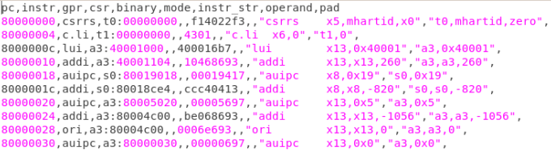
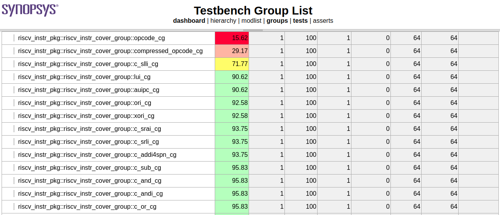

# Extraction of Functional Coverage 
RISC-V DV has a feature for functional coverage extraction from the csv data taken from log files. Data can be taken from ISS trace log or core trace log. This coverage information basically conveys information regarding the degree of randomization in tests. Covergroups are defined in riscv_instr_cover_group.sv. Custom covergroups can be added, however, it should be noted that this coverage is extracted from trace log data only.

## Covergroups Information
- Cover all operands for each instruction
- Hazard conditions
- Corner cases like overflow, underflow, divide by zero
- Aligned/unaligned load/store
- Positive/negative immediate value
- Forward/backward branches
- Hint instruction
- Illegal instruction
- All compressed and uncompressed opcode
- Access to all implemented privileged CSRs
- Exception and interrupt

## CSV Format
Standard CSV format as suggested in Google's RISC-V DV is followed. Snippet of the CSV for log is given below:

  

 <b><i>Figure-1</i>: <i>CSV Standart Format</i></b> 
 
 

## Coverage Report
Coverage report for the functional coverage of randomized test is generated through `urg` command in html format. Snippet of the example coverage report is given below:

  

 <b><i>Figure-2</i>: <i>Coverage Report</i></b> 
 
 

