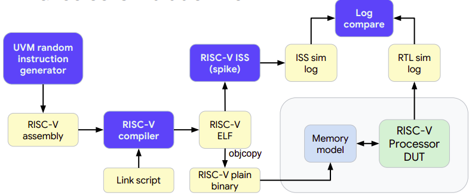

# Spike Integration 
Spike is RISCV ISA Simulator, considered as golden reference for RISC-V. It implements the functional model of RISC-V for one or more harts. RISC-V DV environment also implements ISS flow for the generated test. Test is run both on core and ISS, in this case spike, and comparison is made afterwards for both log files.

  

 <b><i>Figure-1</i>: <i>Spike Flow in Simulation Environment</i></b> 
 
 

## Generation of Spike log 
Spike ISS follows the memory mapping such that after the bootloader, PC starts at `0x80000000` address. Hence, Link file for any test should be adjusted accordingly and `.text` section must start from this location. All other sections must be above this address. 
### Test Compilation
For the Spike simulation, .bin file for program is used for simulation. This binary version of the test program must be compiled and generated with linker flags.

## Generation of Core log
To match the Spike log Program Counter mapping, SweRV-EH1 parameters needs to be set accordingly. Following changes are required.   
### SweRV-EH1 Configuration
#### Core Reset Vector
To match the starting Program Counter (PC) to 32'h80000000 as is the contraint of Spike ISS. Change `Reset Vector` to match the `RV_RST_VEC` of `32'h80000000`.

## Unresolved Issue
### Spike simulation for .s asm tests
Spike simulation for .s asm tests ends in assertion failure. This issue stems from the gcc-compilation issue without linker flag.

